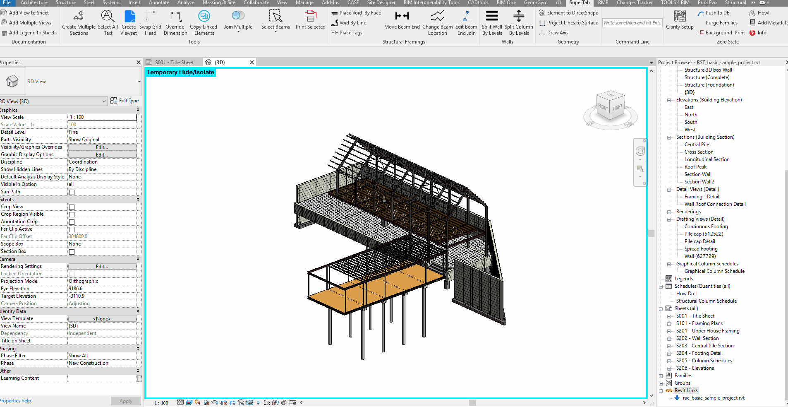
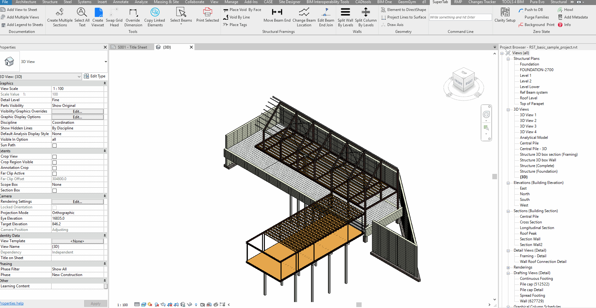
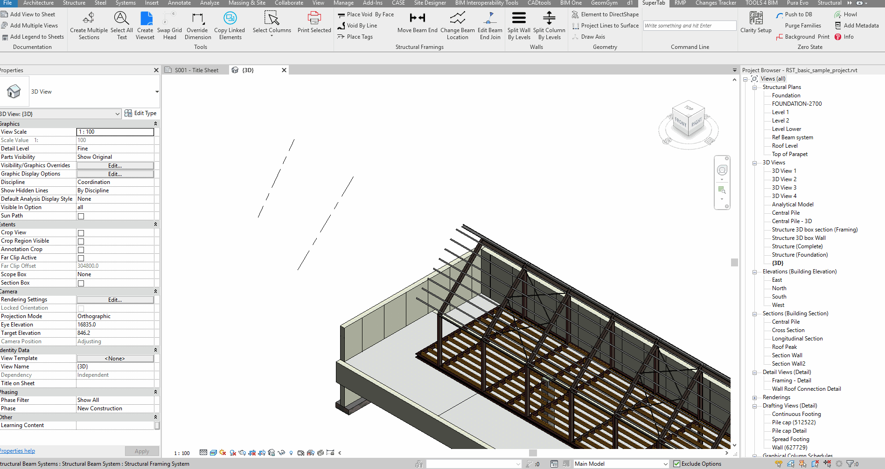
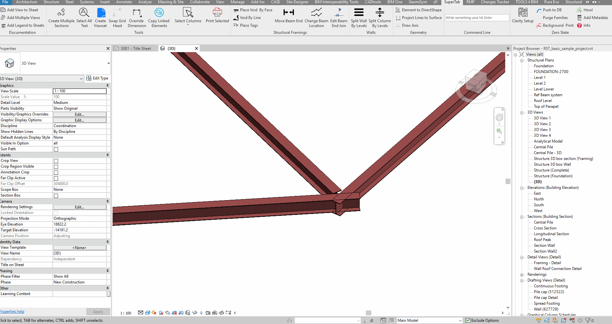
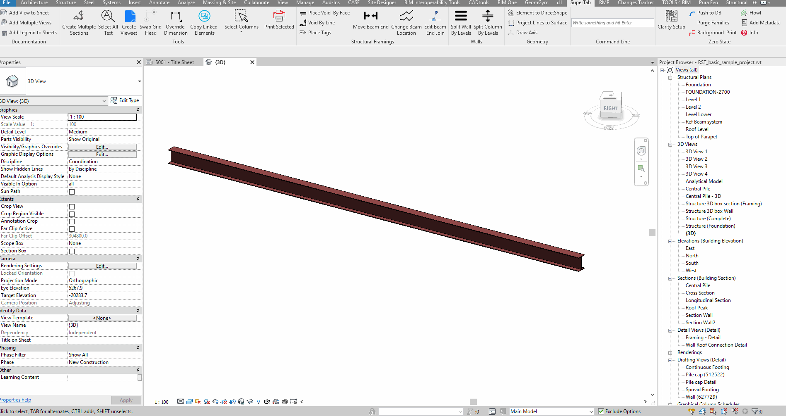

# ReviTab
WIP toolbar for Revit. 

# DOCUMENTATION

## Add View to Sheet
Add the active view to a sheet providing its number.

## Add Multiple Views
Select multiple views in the project browser and add them to a sheet providing its number.

# TOOLS

## Create Multiple Sections
credits: Danny Bentley and others. Create a section from a list of elements that have a location curve.

## Select All Text
Select all text notes in the project and launch the spelling check.

## Create Viewset
Create a viewset from a list of sheet numbers.

## Swap Grid Head
Swap the grid head bubble in the active view. Note: does not work for multi-segmented grids.

## Override Dimension
Set the text dimension to "" for a selected dimension. Does not work on multiple elements or multi-segment dimensions.

## Copy Linked Elements

## Filter Element Selection

# STRUCTURAL FRAMINGS

## Place Void By Face
Add one ore more voids to a beam face providing the distance(s) from the beam start, mid or end point and its size.

## Void By Line
Place a void by face at the intersection between a 2d line (on plan) and a beam. The opening will acquire distance and size from the line style name.

## Place Tags
Modeless window that calculates the distance from the origin to the beam centerpoint and saves it as Mark. The user can accept or refuse the changes.

## Move beam end
Move a beam or multiple beams end point to another element location curve closest point.

## Change Beam Location

## Edit Beam End Join

# WALLS

## Split Wall by Levels
Copy a wall in place and set its Top and Base constraints to the level it intersects. 
Note: 
1. The wall should not have a top/bottom offset applied; 
2. The original wall will be deleted. 

# GEOMETRY

## Element to DirectShape

## Project Lines to Surface

## Draw Axis

# COMMAND LINE

Call methods directly:
keywords: 
* select
+ create
- delete

\> larger

< shorter

= equal

! not equal

examples:

\*Structural Framing -> select all structural framings in the active view.

\*Structural Framing+Length>10000 -> select all structural framings in the active view longer than 10m. 

\*Walls+Mark=aa -> select all walls with a Mark equal to 'aa'

sheets: all -> select all Sheets

sheets: A101 A103 A201 -> select Sheets by Sheet Number

tblocks: all -> select all Title Blocks

# ZERO STATE

## Push to DB
Export selected parameters to a [db](https://remotemysql.com)

Data can be then visualized with online dashboards like [grafana](https://giobel.grafana.net/d/TS8vWBriz/project-2?orgId=1) 

or [desktop](https://github.com/giobel/rvtDashboard) apps

## Background Print
Open a model in background and print its drawings. The printer setting should be already defined in the Revit model. The default printer should be Bluebeam.

## Purge Families
Purge families and leave only a type called Default. Requires the Purge Unused that can be found in the Revit Purge Unused branch. Credits: Matt Taylor https://gitlab.com/MattTaylor/RevitPurgeUnused/blob/master/PurgeTool.vb

## Installation
Extract the content of https://github.com/giobel/ReviTab/blob/master/Addin.zip in C:\Users\yourName.Surname\AppData\Roaming\Autodesk\Revit\Addins\2019
